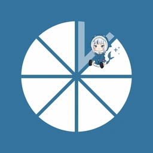

<div align="center">
  

  # Moonlight V+

  [](https://github.com/qiin2333/moonlight-vplus/releases/latest)
  [](https://developer.android.com/about/versions)
  [](LICENSE.txt)
  [](https://github.com/qiin2333/moonlight-vplus/stargazers)
  [](https://github.com/qiin2333/moonlight-vplus/releases)

  **An enhanced Android game streaming client based on [Moonlight](https://github.com/moonlight-stream/moonlight-android)**

  English | [中文](README.md)

</div>

---

## Screenshots

<div align="center">
  
  <br/>
  
  
  
</div>

## What's Different from Upstream Moonlight

Moonlight V+ extends [moonlight-android](https://github.com/moonlight-stream/moonlight-android) with a wide range of enhancements while maintaining full compatibility with the upstream streaming protocol.

| Category | Feature | Description | Since |
|----------|---------|-------------|:-----:|
| **Streaming** | Ultra-high refresh rate | Unlock 144 / 165 Hz, up to 800 Mbps bitrate | |
| | HDR / HLG | Auto-load device-specific HDR calibration profiles, HLG support | `12.6.6` |
| | Custom resolution | Arbitrary resolution, aspect ratio, and asymmetric resolution | |
| | Multi-scene presets | Save and switch streaming configs per game with one tap | `12.3` |
| **Input** | Custom on-screen keys | Drag / resize / hide buttons; combos, turbo fire, gamepad aiming | `12.3.3` |
| | Multi-profile | Multiple key layouts with real-time profile switching | |
| | Wheel pad | Radial menu sectors with custom key bindings | `12.3.7` |
| | Enhanced touch | Stylus, pen, multi-touch, and trackpad mode | `12.3.10` |
| | Motion assist | Gyroscope aim / look with adjustable sensitivity | `12.3.3` |
| | Multi-gamepad | Auto-detect Xbox / PS / Switch / third-party controllers | `12.5.3` |
| **UI** | App desktop polish | Thumbnail backgrounds, custom sorting | |
| | Action cards | Quick-access shortcuts, commands, and performance panels | |
| | Live bitrate tuning | Adjust bitrate from the in-stream menu without disconnecting | `12.3.10` |
| | Floating ball | Gesture-based shortcut bubble | `12.7.3` |
| | QR pairing | Scan QR code to pair with host | `12.7.4` |
| **Streaming+** | External display | One-tap secondary screen with rotation sync | `12.6.5` |
| | Keep-alive | Switch apps without tearing down the stream | `12.6.6` |
| | Multi-screen select | Choose which host screen to stream | `12.5.0` |
| **Monitoring** | Performance overlay | FPS, 1% low FPS, bitrate, latency, packet loss, etc. | `12.4.1` |
| **Audio** | Mic redirect | Remote voice chat (requires Foundation Sunshine) | `12.3.12` |
| | 7.1.4 surround | Atmos spatial audio support | `12.7.4` |
| | Audio vibration | Real-time bass energy drives haptic feedback (device / gamepad / both) | `12.7.0` |
| | | Three scene modes: Game (sustained rumble), Music (beat pulses), Auto | |

To choose a feature by what you want to do, see the [Moonlight V+ feature guide](docs/VPLUS_FEATURES_EN.md): Crown profiles, Foundation Sunshine actions, displays, haptics, and frame generation.

## Getting Started

### Requirements

- Android 5.0+ (API 22)
- Device with HEVC / AV1 hardware decoding (recommended)
- 5 GHz / 6 GHz Wi-Fi or wired LAN connection
- A host PC running [Foundation Sunshine](https://github.com/AlkaidLab/foundation-sunshine) (recommended). Standard streaming also works with [Sunshine](https://github.com/LizardByte/Sunshine); legacy NVIDIA GameStream may work on existing setups.

### Installation

Download the latest APK from [Releases](https://github.com/qiin2333/moonlight-vplus/releases/latest), install it, and pair it with your host.

For the first stream, start with a conservative profile:

- 1080p, 60 FPS
- H.264 or Auto codec
- HDR off
- 10-20 Mbps bitrate
- Host PC connected by Ethernet when possible

After that is stable, raise resolution, frame rate, bitrate, HEVC / AV1, HDR, and V+ enhanced options one at a time.

### Host Choice

- **Foundation Sunshine (recommended)**: the companion host for Moonlight V+, providing standard streaming and supported V+ extensions such as microphone forwarding and host display control. Feature availability depends on the host version.
- **Sunshine**: supports standard Moonlight streaming; some V+ extensions need Foundation Sunshine.
- **GeForce Experience / NVIDIA GameStream**: a legacy compatibility path for existing setups. Choose Foundation Sunshine for a new installation.

### If Something Goes Wrong

- Black screen or decoder crash: try H.264, turn HDR off, lower resolution / FPS, then reconnect.
- Stutter or "slow connection": lower bitrate first, then check Wi-Fi quality, packet loss, and latency variance in the performance overlay.
- Android TV / TV box issues: test 1080p60 H.264 before trying HEVC, AV1, HDR, or high refresh rates.
- Internet streaming issues: verify local LAN streaming works before configuring port forwarding, UPnP, EasyTier, Tailscale, or other VPN paths.

Useful references:

- [Moonlight V+ Q&A](FAQ_EN.md)
- [Moonlight setup guide](https://github.com/moonlight-stream/moonlight-docs/wiki/Setup-Guide)
- [Moonlight troubleshooting guide](https://github.com/moonlight-stream/moonlight-docs/wiki/Troubleshooting)
- [V+ feature guide](docs/USER_GUIDE_EN.md)
- [First connection with Foundation Sunshine](docs/GETTING_STARTED_EN.md)
- [Foundation Sunshine compatibility matrix](docs/COMPATIBILITY_EN.md)
- [Backups and migration](docs/BACKUP_AND_MIGRATION_EN.md)

### Building from Source

Install JDK 17, Android SDK 36, Build Tools 36.0.0, NDK 28.2.13676358, and CMake 3.22.1 first. The build also needs two Git submodules and a separate [audio-haptics SDK](https://github.com/AlkaidLab/moonlight-audio-haptics) checkout; see [CI](.github/workflows/android-ci.yml) for the pinned revision.

```bash
git clone --recurse-submodules https://github.com/qiin2333/moonlight-vplus.git
cd moonlight-vplus
git clone https://github.com/AlkaidLab/moonlight-audio-haptics.git ../moonlight-audio-haptics
git -C ../moonlight-audio-haptics checkout b3f97c3bb7500ea7b1985aea568e5c7b40308d3b
./gradlew :app:assembleNonRootDebug -PaudioHapticsSdkDir="$PWD/../moonlight-audio-haptics"
```

On Windows PowerShell, use `.\gradlew.bat :app:assembleNonRootDebug -PaudioHapticsSdkDir="$PWD/../moonlight-audio-haptics"` for the last line. Release distribution also requires signing. A local build can omit `app/google-services.json`, but Firebase reporting will not work without it.

## Foundation Sunshine Enhanced Features

The following features require **[Foundation Sunshine](https://github.com/AlkaidLab/foundation-sunshine)** on the host side:

| Feature | Description | Host requirement |
|---------|-------------|-------------|
| Mic redirect | Microphone audio forwarding to the host | Foundation Sunshine 2025.0720+ |
| Live bitrate adjustment | Dynamically tune video bitrate during a session | — |
| Super menu commands | Send advanced control commands to the host from the in-stream menu | — |
| App desktop polish | Sync host app icons; custom sorting and grouping | — |
| Host auto-optimization | Auto-negotiate resolution/DPI, touch keyboard, and state memory | — |

Features without a listed minimum still need release-build verification. See the [compatibility matrix](docs/COMPATIBILITY_EN.md) for version evidence and how to update it.

## Contributing

Issues and Pull Requests are welcome!

Before reporting a problem, check the [Q&A](FAQ_EN.md). See the [privacy notice](PRIVACY_POLICY_EN.md) for analytics and crash-report handling.

### Contributors

| Contributor | Focus Area |
|-------------|------------|
| [@cjcxj](https://github.com/cjcxj) | Custom keys, touch menu, accessibility |
| [@alonsojr1980](https://github.com/alonsojr1980) | SoC decoder optimization |
| [@Xmqor](https://github.com/Xmqor) | Gamepad aiming |
| [@TrueZhuangJia](https://github.com/TrueZhuangJia) | Enhanced multi-touch |
| [@WACrown](https://github.com/WACrown) | Custom key system |

## Acknowledgments

- [Moonlight Android](https://github.com/moonlight-stream/moonlight-android) — upstream project
- [Sunshine](https://github.com/LizardByte/Sunshine) — open-source game streaming host

## License

This project is licensed under the [GPL v3](LICENSE.txt).

---

<div align="center">
  <sub>Find it useful? Give us a ⭐!</sub>
</div>
