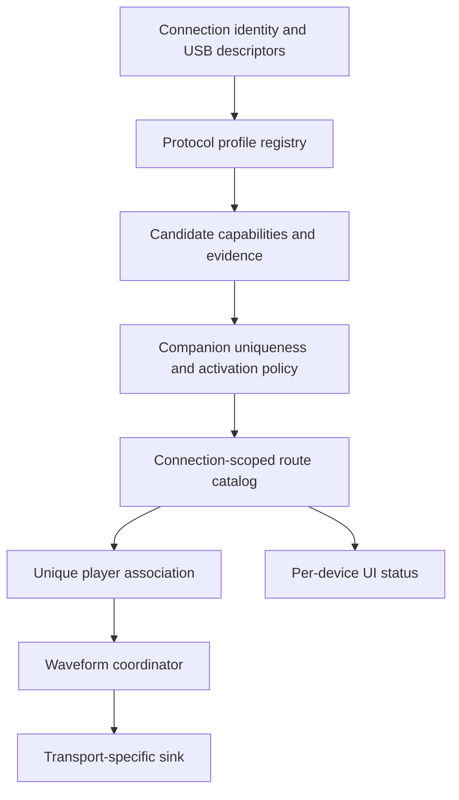

# Automatic controller waveform haptics

## User behavior

Controller discovery runs automatically whenever a USB host is available, including
when Moonlight's ordinary USB input driver is disabled. There is no brand enable
switch and no need to choose a controller model.

Each recognized connection appears in the stream menu audio-haptics card with its
own state: needs validation, needs USB permission, needs a unique player association,
busy, initializing, ready, failed, or unavailable. Unknown devices retain ordinary
vibration; this does not assert that their hardware lacks waveform support.

A channel that fails to open is rebuilt automatically with a growing backoff
(5 s to 60 s). After five consecutive builds without a working channel, the route
stays failed instead of retrying forever; replugging the controller or restarting
the stream resets that budget.

**Allow experimental haptic protocols** is an optional validation-policy setting,
default off. It permits trying recognized but unverified protocols, across brands.
It does not enable discovery, bypass descriptor checks, infer support from device
names, or promote a protocol to validated. Reconnect the stream after changing it.
A validated profile automatically proceeds to activation, requesting USB permission
when necessary. The current Kishi and DualSense UAC profiles remain experimental;
no new profile has been declared hardware-validated by this implementation.

## Responsibilities



- `HapticBackendRegistry` performs passive matching. Profiles cannot open hardware
  during discovery. Built-in profiles recognize Kishi USB and Sony DualSense USB;
  Bluetooth does not inherit USB capabilities.
- A device gets at most one output companion: an ambiguous competing claim opens
  nothing rather than being resolved by registration order.
- `HapticActivationPolicy` separately checks protocol evidence, API level, descriptor
  layout, unique device association, permission and external ownership. A descriptor
  match can reach `INITIALIZING`, never `READY` by itself.
- `HapticRouteCatalog` keys routes by connection instance and backend and allocates
  fresh tokens on channel restart, detach/reconnect or identity/layout changes. Late callbacks for
  old tokens are discarded. Two identical models have separate state.
- `UsbWaveformBackends` contains Android transport factories. This is where device
  implementations are registered; the USB service and input handler do not switch
  on brands or cast to Kishi classes.
- `UsbWaveformController` owns an output-only companion's USB lifetime. It never
  registers a second gamepad or allocates a player. It participates in existing USB
  forwarding and stop-completion handling. Combined input/UAC devices remain owned
  by their existing input driver; discovery alone never takes that driver over.
- `ControllerHandler` associates a companion with an existing Android input instance
  and player. Unknown or ambiguous associations cannot receive waveform output.
  Losing an association asks the transport owner to close and re-probe with a fresh
  token; no queued samples carry over to another player. Removing an identical USB
  device triggers discovery again for the remaining devices.
  The host's authored-content request is based on discovered capabilities and remains
  independent of local USB permission and output readiness.
- `WaveformHapticsSink` is transport-neutral. Optional `WaveformPlaybackControl` and
  `WaveformChannelTest` interfaces expose ownership and testing without device casts.
  The existing DualSense sink interface remains a compatible subtype.
- The coordinator handles startup and stale connection generations. Ordinary motor
  output yields while a sink's playback control owns those motors, then resumes
  after that sink disables waveform playback. Trigger feedback is separate.
- The menu renders a dedicated waveform card — separate from the audio-haptics
  card — with one status/test row per discovered route, and only while at least
  one route exists. Testing selects a route ID, not a brand or an arbitrary first
  device. Tests are cancelled when the game menu is dismissed.

## Host negotiation and fallback

The current Sunshine host selects controller emulation through `gamepad=ds5` on
both `/launch` and `/resume`. `LI_CCAP_PREFER_DS5` alone is not sufficient for that
host version. The client now exposes Automatic, Follow host, Xbox 360, DS4 and DS5.
Explicit selection wins. Automatic requests DS5 when the screen touchpad is enabled
or a descriptor/API/validation-eligible USB waveform controller is present before
launch. Host selection is session-wide, including other players. Host policy may
reject the override or fall back if its DS5 component is unavailable. A controller
plugged in after launch cannot change that query: reconnect or select DS5 beforehand.
Legacy arrival metadata retains the PS type/DS5 preference for compatible older hosts;
metadata replacement releases the correct player slot, including players beyond zero.

PCM is a separate session-wide SDP capability. It is enabled only when an eligible waveform controller is present at launch,
controller output is enabled, and the explicit host choice is neither Xbox nor DS4.
Enabling experimental protocols alone never changes session PCM negotiation.
Eligibility is a passive descriptor/API/evidence check, not proof of permission or
working output. Connecting the first eligible controller after launch requires
reconnecting to negotiate PCM.
The JNI callback is selected on a connection-local copy, so a later legacy session
cannot inherit it. The existing common-c parser, control packet and JNI frame are
reused. No new wire protocol or per-player PCM capability is invented; the current
host chooses raw PCM versus its legacy reducer using the session feature flags.

Because that choice disables host-side PCM-to-rumble fallback for the entire session,
Android now supplies its own conservative energy fallback for players without a
working waveform sink, including output failures and unplugging. It folds both
actuator lanes to equal motor amplitudes at 0.25 gain; this is deliberately a lossy
approximation, not the host SDK's perceptual reconstruction. The fallback is an
independent AUTHORED mixer source, preserves ordinary HOST rumble, respects the
controller/device routing preference, expires after 50 ms without fresh packets,
and has at most one queued main-thread dispatch plus one latest value per player.
Malformed, duplicate and reordered frames are rejected; sequence wrap and explicit
stream restart are supported. Direct output clears only the authored fallback.

This change is client-only: common-c stays at `31a2a4589ea926988a08ca508bb317fbfbe2a177`;
there are no new feature bits, messages or host requirements. The host's existing
session-wide routing and process-global gamepad preference behavior are unchanged.
Consequently mixed-player PCM fallback is an approximation, and concurrent-session
type isolation cannot be guaranteed by this client change.

## Current transport adapters

Kishi uses two separate experimental backends. VID 0x1532 / PIDs 0x0719,
0x071a, 0x0721 and 0x0724 retain the original interface-3 PCM protocol and
non-forced claim. Shared PID 0x0037 and name-only guesses are excluded.

Kishi V3 Pro XL (0x0727) uses `razer-kishi-xl-sensa`: interface ID 4,
alternate 0, HID class, exactly two 64-byte Interrupt endpoints (OUT 0x04,
IN 0x84). It may detach the kernel driver only on this dedicated interface;
gamepad input interfaces remain untouched. API 26+ is required for bounded
request completion waits. Startup reads and validates the device metadata,
selects DESIGN mode if necessary, and remembers the original mode for cleanup.
Every stream report consumes and checks its echo acknowledgement. Unrelated
queued replies are skipped within the same bounded deadline.

The independent XL encoder approximates stereo S16LE input with three spectral
bands per actuator. It uses 40 ms Hann windows, 10 Hz frequency search steps,
four interpolated amplitude points per 10 ms output frame, and a user-selected
gain from 0 to 1 (default 1), also used to cap each band's amplitude. This is lossy PCM-to-Sensa conversion,
not raw PCM output or a reimplementation of Cortex's perceptual processing.
Input rates must be between 3 and 48 kHz and divisible by 100. Recent silence
zeros amplitudes immediately; discontinuities reset history. The sink drops
queued packets older than 30 ms, emits silence after an idle timeout or stream
end, and performs bounded silence/mode restoration during shutdown. No Cortex
APK, native library, preset, or runtime dependency is included in the app.

The Kishi encoder preserves stereo channel separation and resampling state across
blocks. It converts S16LE to 4 kHz, using a 63-tap anti-alias filter for downsampling,
conservative gain, clamping and 64-byte packet encoding. It queues at most ten 3 ms
packets, drops locally stale packets, flushes discontinuities/end-of-stream, and checks
USB transfer completion length. The budget measures local software age, not total
latency. Host presentation timestamps are not synchronized to the Kishi device clock.
The Kishi backend also disables its waveform motor mode after 30 ms without a played
packet, emitting silence during short underruns. This transport-local idle budget is
independent of the 50 ms ordinary-rumble fallback expiry; the fallback timeout is not
a minimum hold time for raw waveform devices. Extending idle mode would not restore
missing waveform samples.

Kishi supports a cancellable, low-amplitude test: 400 ms left followed by 400 ms right.
Host PCM is ignored during the test. Shutdown logs sent, dropped and silence packets.
The XL channel test, converted rumble and streamed PCM use the Sensa strength setting.
The tone test uses full-scale amplitude at 100%; 0% mutes output.
The XL channel test plays left for 1 second, silence for 1 second, then right
for 1 second. The 250 ms simultaneous tuning preview is independent of this test.
A local Sensa test button directly below the Sansa HD support toggle acquires
the USB companion through the existing service without requiring a host stream
or player association. It refuses to interrupt an active streaming session.

The in-stream popup has a separate Sansa HD support card beside Audio Haptics.
Its header controls the independent Kishi XL enable preference and collapses the
settings when disabled. The legacy experimental switch still controls other
experimental backends. Its previous value is migrated once into the new preference.
The live USB session releases/reopens only the Sensa output companion;
session-token checks prevent an old UI owner from changing a new stream.
Inside are a three-mode selector, channel test, strength (0–100%)
and frequency (30–400 Hz) controls, followed by the same host emulation choices
as Settings. Changing emulation applies on reconnection, with a pending notice. These
share preferences with the standalone settings. Both sliders have minus/plus buttons
with a step of 5; tuning changes preview both actuators for 250 ms at the selected
strength and frequency. Repeated changes restart the preview deadline, and closing
the menu cancels tests. The haptic channel test is in this card, independently of
the Audio Haptics switch. Labels are localized for all
28 existing locale configurations, in addition to the default English resources.

Ordinary host rumble reaches the existing source mixer and routing policy first.
An optional Sensa rumble output converts its low/high motor amplitudes into
left/right tones with four amplitude interpolation points per 10 ms packet.
Zero stops the tone; strength zero mutes it. The default mode is Haptic or rumble; existing conversion-off users migrate to
Only haptic. Only haptic ignores ordinary rumble, including Android motor output
while the Sensa route owns the device. Rumble only ignores authored PCM and
converts ordinary rumble. Mode changes clear obsolete queued PCM.
In Haptic or rumble, authored PCM takes precedence while current (30 ms); conversion resumes with
the latest rumble state afterward. The local channel test temporarily overrides
both sources. Frequency controls tones only; authored PCM retains its spectrum.
Stream teardown releases the same transport and restores the prior controller mode.

Kishi XL advertises ordinary rumble and no longer automatically requests DS5.
Explicit DS5 selection remains available for authored effects. Other backends
retain their previous host-selection and rumble behavior.

The DualSense profile recognizes Sony USB identities and UAC streaming OUT descriptors.
Its existing input driver owns interface setup. The Java isochronous transport remains
unverified; experimental activation is subject to the same validation policy. This
change does not repair Android isochronous transport support or establish Bluetooth PCM
capability. Merely finding a USB sound card does not establish motor channel mapping.

The Kishi initialization and packet-format reference is the public
[PeaSyo implementation](https://github.com/Geocld/PeaSyo/blob/master/android/app/src/main/java/com/peasyo/input/RazerKishiController.java),
reviewed on 2026-09-18. Initialization success is transport evidence, not proof of XL
compatibility, mechanical waveform fidelity, channel polarity or firmware compatibility.

## Extending support

Add a passive `HapticProtocolProfile` and its transport factory (or integrate an existing
input-driver-owned sink). Provide the actual format, ownership mode, minimum platform
version, descriptor constraints and evidence. Upper-level discovery, policy, player
routing and UI need no new brand condition. Hardware validation is recorded in the
profile; runtime permission, handles and readiness are never persisted as capability.

System/vendor capability providers may use the same candidate model, but no fictional
universal Android PCM query is implemented here. Arbitrary unknown protocols, Nexus
AIDL, rumble-to-PCM synthesis, a manual identical-device association selector and new
Bluetooth transports are outside this implementation.

## Validation

### Kishi V3 Pro XL 0x0727 validation (2026-09-20)

On Honor ROD2-W09S / Android 16 (API 36), the legacy Feature report failed
because the XL interface has no Feature reports. The separate Sensa transport
successfully read mode 0 and 879 bytes of metadata identifying Denise V2 T1 XL,
bodypart IDs 216 and 116, three bands, four points and two transients.

An initial diagnostic using offline-generated reference packets produced physical
vibration, confirmed by the user. Subsequently the independent production encoder
and sink passed the opt-in device test, including startup, channel-test expiry,
silence and USB release. The user confirmed **left then right** vibration from
this independent implementation. No vendor encoder is used in that test or app.

Thirty targeted unit tests pass: legacy Kishi encoder and registry regression,
Sensa packet vectors, three-band framing, invalid values, stereo isolation,
chunk invariance, silence and reset. These checks do not establish game-stream
fidelity, sustained performance, unplug behavior, or compatibility with other
firmware. The XL profile therefore remains experimental.

With debug and androidTest APKs installed and USB permission granted:

```sh
# Passive descriptor query (no vibration)
adb shell am instrument -w -r -e class com.limelight.binding.input.haptics.KishiUsbDescriptorTest#readReportDescriptors -e kishiDescriptors true com.limelight.vplus_debug.test/androidx.test.runner.AndroidJUnitRunner
# Independent production sink: 1 s left, 1 s pause, 1 s right
adb shell am instrument -w -r -e class com.limelight.binding.input.haptics.KishiUsbDescriptorTest#testIndependentSensa -e kishiIndependentPulse true com.limelight.vplus_debug.test/androidx.test.runner.AndroidJUnitRunner
```

Hardware diagnostics are skipped unless explicitly enabled. They interrupt a
running target-app stream. Close Cortex before testing to avoid USB ownership
conflicts. Live game-stream validation is the next hardware acceptance step.

### Android device software validation (2026-09-18)

Installed the non-root debug APK built from `707abe2ab` on a Meizu 17,
Android 13 / API 33 / arm64-v8a, using `adb install -r` to preserve app data.
Version: `12.12.8-beta.2` (`121208002`), package `com.limelight.vplus_debug`.
Cold launch succeeded. No Kishi or other USB host device was attached.

`WaveformSoftwareDeviceTest` and `UsbDevicePanelTest` passed together: **10 tests**.
The targeted tests exercise JNI loading and disconnected-input rejection, actual
Android USB enumeration with no false waveform candidate, 48-to-4 kHz packetization
and stereo isolation on ART, fallback duplicate/end handling, and three consecutive
USB service session attach/release cycles with startup and completion callbacks.
The USB panel tests exercise touch and injected controller-key interaction.

The initial service test invoked a legacy API stripped by R8; the final test uses
the same explicit `attachSession` / `releaseSession` APIs as streaming. No production
behavior or minification rules were changed to make the test pass.

Reproduce after installing both debug and androidTest APKs:

```sh
adb shell am instrument -w -r -e class com.limelight.binding.input.haptics.WaveformSoftwareDeviceTest,com.limelight.UsbDevicePanelTest com.limelight.vplus_debug.test/androidx.test.runner.AndroidJUnitRunner
```

This is software validation, not a Kishi hardware or live-stream acceptance result.
USB permission/claim, packet delivery, actual actuator output, disconnect during
playback and concurrent input/output remain unverified without the controller.

Unit tests exercise both built-in profiles, rejection of name-only/unknown/incorrect-mode
matches, descriptor constraints, evidence ordering, competing backends, validated-profile
automatic activation, permissions, occupation, independent identical-device state,
reconnect/layout-change tokens and late callback rejection. Encoder tests cover channel
isolation, chunk-invariant resampling, reset, packet layout/checksum, malformed data and
anti-alias attenuation. PCM fallback tests cover malformed payloads, independent player
sequences, wrap/restart, terminal zero, expiry, source isolation and explicit host-selection
precedence. JNI is compiled through the Android native build. Existing haptic mixing/lifecycle/forwarding tests remain in use.

Hardware acceptance before changing profile evidence:

1. Record the exact model, mode, firmware and descriptors.
2. Verify left/right test output, polarity, cancellation and stop behavior.
3. Check that buttons and sticks still arrive exactly once during output.
4. Verify authored host PCM separately from the built-in test.
5. Exercise denied permission, a busy interface, unplug during startup/playback and
   stream exit; confirm ordinary fallback and no stuck vibration.
6. Connect identical devices and change modes/player assignment; verify no cross-player
   waveform output and fresh readiness after reconnect.
7. Forward an active USB device; ensure forwarding waits for local handle release.
8. Measure sustained latency, underruns, thermal load and artifacts across supported
   Android builds and firmware. Successful writes alone do not complete validation.
