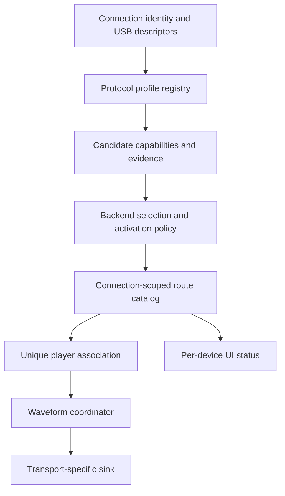

# Automatic controller waveform haptics

## User behavior

Controller discovery runs automatically whenever a USB host is available, including
when Moonlight's ordinary USB input driver is disabled. There is no brand enable
switch and no need to choose a controller model.

Each recognized connection appears in the stream menu audio-haptics card with its
own state: needs validation, needs USB permission, needs a unique player association,
busy, initializing, ready, failed, or unavailable. Unknown devices retain ordinary
vibration; this does not assert that their hardware lacks waveform support.

**Allow experimental haptic protocols** is an optional validation-policy setting,
default off. It permits trying recognized but unverified protocols, across brands.
It does not enable discovery, bypass descriptor checks, infer support from device
names, or promote a protocol to validated. Reconnect the stream after changing it.
A validated profile automatically proceeds to activation, requesting USB permission
when necessary. The current Kishi and DualSense UAC profiles remain experimental;
no new profile has been declared hardware-validated by this implementation.

## Responsibilities

- `HapticBackendRegistry` performs passive matching. Profiles cannot open hardware
  during discovery. Built-in profiles recognize Kishi USB and Sony DualSense USB;
  Bluetooth does not inherit USB capabilities.
- `HapticBackendSelector` prefers platform evidence, vendor SDK evidence, validated
  protocols, then experimental protocols. Equal competing claims are not resolved
  by registration order. Only the selected companion backend may open a device.
- `HapticActivationPolicy` separately checks protocol evidence, API level, descriptor
  layout, unique device association, permission and external ownership. A descriptor
  match can reach `INITIALIZING`, never `READY` by itself.
- `HapticRouteCatalog` keys routes by connection instance and backend and allocates
  fresh tokens on channel restart, detach/reconnect or identity/layout changes. Late callbacks for
  old tokens are discarded. Two identical models have separate state.
- `UsbWaveformBackends` contains Android transport factories. This is where device
  implementations are registered; the USB service and input handler do not switch
  on brands or cast to Kishi classes.
- `UsbWaveformController` owns an output-only companion's USB lifetime. It never
  registers a second gamepad or allocates a player. It participates in existing USB
  forwarding and stop-completion handling. Combined input/UAC devices remain owned
  by their existing input driver; discovery alone never takes that driver over.
- `ControllerHandler` associates a companion with an existing Android input instance
  and player. Unknown or ambiguous associations cannot receive waveform output.
  Losing an association asks the transport owner to close and re-probe with a fresh
  token; no queued samples carry over to another player. Removing an identical USB
  device triggers discovery again for the remaining devices.
  The host's authored-content request is based on discovered capabilities and remains
  independent of local USB permission and output readiness.
- `WaveformHapticsSink` is transport-neutral. Optional `WaveformPlaybackControl` and
  `WaveformChannelTest` interfaces expose ownership and testing without device casts.
  The existing DualSense sink interface remains a compatible subtype.
- The coordinator handles startup and stale connection generations. Ordinary motor
  output yields while a sink's playback control owns those motors, then resumes
  after that sink disables waveform playback. Trigger feedback is separate.
- The menu renders one status/test row per discovered route. Testing selects a route
  ID, not a brand or an arbitrary first device. Tests are cancelled when the card
  controller is disposed.

## Host negotiation and fallback

Explicit Xbox 360 / DS4 / DS5 choices use the existing `gamepad` parameter on
`/launch` and `/resume`. Sunshine snapshots it into the streaming session and
passes it to both explicit-arrival and implicit-input controller allocation.
A second session can no longer overwrite it. Host override policy still applies.

Automatic selection sends no session-wide override. Instead each eligible player's
arrival carries `LI_CCAP_PREFER_DS5=0x8000`, now defined in common-c. New Sunshine
honors this only in auto mode; explicit host/client types still win. If the optional
DS5 component is unavailable, a client preference degrades to DS4. Follow host clears
the preference bit while retaining screen touchpad metadata. Older Sunshine versions
that ignore the bit require explicitly choosing DS5; discovery never changes every
player to DS5. Hot-plug metadata changes can still recreate that player's virtual
controller when its **emulated type** changes, but output readiness never does.

PCM decoding support, descriptive device capability (`LI_CCAP_DS5_HAPTICS_PCM=0x200`),
and a currently operational output are distinct. The capability bit alone is not a
readiness update and does not disable host synthesis. The new common-c opt-in
`STREAM_CONFIGURATION.perControllerHaptics` negotiates the following extension:

| Direction | Definition | Meaning |
|---|---|---|
| Host SDP | `LI_FF_CONTROLLER_HAPTICS=0x400` | Supports per-player readiness |
| Client SDP | `ML_FF_CONTROLLER_HAPTICS=0x20`, plus PCM `0x04` | Start every player in host fallback |
| Client input | `SS_CONTROLLER_HAPTICS_MAGIC=0x5500000B` | Update one allocated player's readiness |

The input message is exactly 12 bytes: existing 8-byte input header (size 8, big
endian; magic little endian), player uint8 (0–15), ready uint8 (0/1), two zero
reserved bytes. It uses the same reliable ENet channel as that player's arrival and
removal; it changes neither controller type nor button state. Removal resets readiness.
Truncated, oversized, invalid-player, invalid-mode and nonzero-reserved messages are
rejected. No new PCM format or changes to the existing PCM/IR feedback types are needed.

Android registers decoding support independently of experimental device activation.
Only an operational, assigned sink with controller output enabled publishes ready.
Arrival is queued first. Readiness changes are immediate on attach/detach/failure;
a 250 ms state-only health check handles asynchronous failure, routing preferences
and failed enqueue retries. It does not rescan USB or send unchanged state.

Sunshine keeps its existing per-player SDK PCM-to-rumble reducer for all non-ready
players and clears the old synthesized source when switching to raw PCM. Compatibility
rumble and trigger feedback remain independent. Android validates incoming PCM and
routes it to the matching sink; it no longer folds stereo actuator PCM into equal
motor amplitudes. Trailing unreliable PCM after disabling is dropped without a sink.

| Client / host | Result |
|---|---|
| New / new | Per-player ready routes receive PCM; all other players use host synthesis |
| New / old | No PCM feature advertised; host synthesis preserved; explicit DS5 choice still works |
| Old / new | Historical session-wide PCM or IR semantics retained |
| Old / old | Unchanged |

Queue success is **not** an acknowledgement. The protocol provides ordered readiness
delivery, not a time-synchronized transition or a route-generation fence in PCM.
A change can take network transit time plus up to 250 ms failure detection; existing
transport idle/watchdog behavior remains necessary. Reordering/loss of unreliable
PCM is handled by existing sequence validation. Hardware and multi-peer network
acceptance are still required before claiming seamless transitions.

## Current transport adapters

Kishi uses VID 0x1532 and candidate PIDs 0x0719, 0x071a, 0x0721, 0x0724. Shared PID
0x0037 and name-only guesses are excluded. Its experimental profile requires interface
ID 3 (not enumeration index), alternate 0, HID class, one 64-byte Interrupt OUT endpoint
and no input endpoints. The backend uses `claimInterface(..., false)`; a busy kernel
interface is not forcibly detached. API 26+ is required for bounded completion waits.

The Kishi encoder preserves stereo channel separation and resampling state across
blocks. It converts S16LE to 4 kHz, using a 63-tap anti-alias filter for downsampling,
conservative gain, clamping and 64-byte packet encoding. It queues at most ten 3 ms
packets, drops locally stale packets, flushes discontinuities/end-of-stream, and checks
USB transfer completion length. The budget measures local software age, not total
latency. Host presentation timestamps are not synchronized to the Kishi device clock.
The Kishi backend also disables its waveform motor mode after 30 ms without a played
packet, emitting silence during short underruns. This transport-local idle budget is
independent of the host reducer's 100 ms watchdog. Extending idle mode would not
restore missing waveform samples.

Kishi supports a cancellable, low-amplitude test: 400 ms left followed by 400 ms right.
Host PCM is ignored during the test. Shutdown logs sent, dropped and silence packets.

The DualSense profile recognizes Sony USB identities and UAC streaming OUT descriptors.
Its existing input driver owns interface setup. The Java isochronous transport remains
unverified; experimental activation is subject to the same validation policy. This
change does not repair Android isochronous transport support or establish Bluetooth PCM
capability. Merely finding a USB sound card does not establish motor channel mapping.

The Kishi initialization and packet-format reference is the public
[PeaSyo implementation](https://github.com/Geocld/PeaSyo/blob/master/android/app/src/main/java/com/peasyo/input/RazerKishiController.java),
reviewed on 2026-09-18. Initialization success is transport evidence, not proof of XL
compatibility, mechanical waveform fidelity, channel polarity or firmware compatibility.

## Extending support

Add a passive `HapticProtocolProfile` and its transport factory (or integrate an existing
input-driver-owned sink). Provide the actual format, ownership mode, minimum platform
version, descriptor constraints and evidence. Upper-level discovery, policy, player
routing and UI need no new brand condition. Hardware validation is recorded in the
profile; runtime permission, handles and readiness are never persisted as capability.

System/vendor capability providers may use the same candidate model, but no fictional
universal Android PCM query is implemented here. Arbitrary unknown protocols, Nexus
AIDL, rumble-to-PCM synthesis, a manual identical-device association selector and new
Bluetooth transports are outside this implementation.

## Validation

Unit tests exercise both built-in profiles, rejection of name-only/unknown/incorrect-mode
matches, descriptor constraints, evidence ordering, competing backends, validated-profile
automatic activation, permissions, occupation, independent identical-device state,
reconnect/layout-change tokens and late callback rejection. Encoder tests cover channel
isolation, chunk-invariant resampling, reset, packet layout/checksum, malformed data and
anti-alias attenuation. PCM validation tests cover malformed payloads, independent player
sequences and wrap/restart. Readiness tests cover arrival ordering, retries, duplicate
suppression and player reuse. Common-c golden tests cover the compatibility matrix
and exact wire validation; host tests cover type-selection precedence and session preferences. JNI is compiled through the Android native build. Existing haptic mixing/lifecycle/forwarding tests remain in use.

Hardware acceptance before changing profile evidence:

1. Record the exact model, mode, firmware and descriptors.
2. Verify left/right test output, polarity, cancellation and stop behavior.
3. Check that buttons and sticks still arrive exactly once during output.
4. Verify authored host PCM separately from the built-in test.
5. Exercise denied permission, a busy interface, unplug during startup/playback and
   stream exit; confirm ordinary fallback and no stuck vibration.
6. Connect identical devices and change modes/player assignment; verify no cross-player
   waveform output and fresh readiness after reconnect.
7. Forward an active USB device; ensure forwarding waits for local handle release.
8. Measure sustained latency, underruns, thermal load and artifacts across supported
   Android builds and firmware. Successful writes alone do not complete validation.
