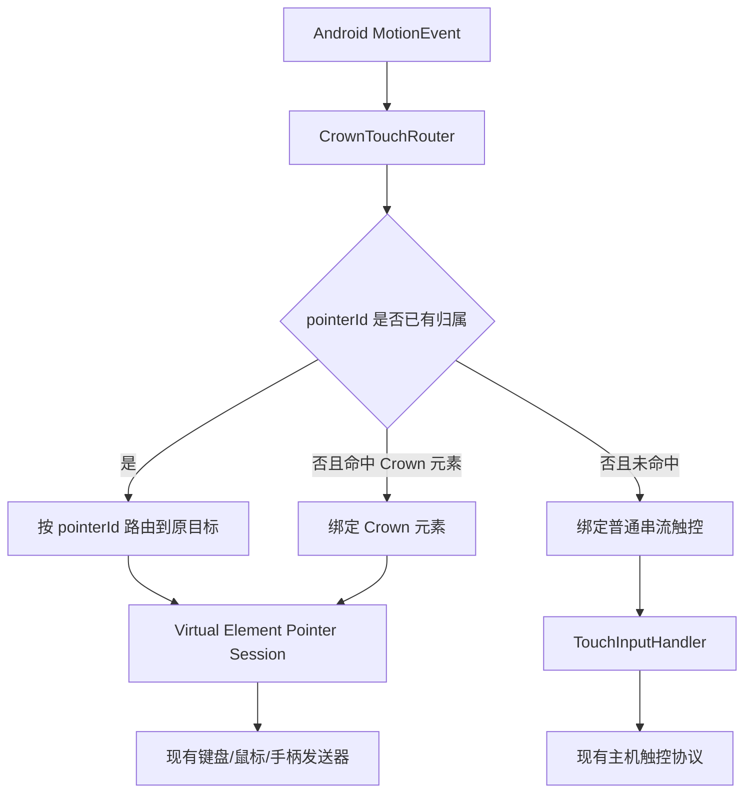

# Issue #234：Crown 虚拟按键多指触控设计

## 1. 结论

Issue #234 的目标是：一根手指持续按住 Crown 虚拟摇杆或移动键时，另一根手指可以直接操作串流画面，例如转动《我的世界》视角；两根手指的输入互不抢占、互不改写，也不会因为第二根手指移动而让第一根虚拟按键跟随移动。

当前实现没有完整支持这个功能，准确地说是两套触控能力并存但边界不一致：

- 普通串流触控路径已经按 Android pointer ID 建立了多指状态，可以向主机发送多根独立触点。
- Crown 虚拟按键路径仍由多个普通 Android View 分别接收事件，且 `Element.onTouchEvent()` 会直接忽略 `event.getActionIndex() != 0` 的事件。第二根手指的 `ACTION_POINTER_DOWN`、移动和抬起不能被绑定到另一个虚拟元素。
- Crown 虚拟元素的按下、移动、释放状态大多是单值字段，例如单个 `pressed`、`lastX/lastY`、单个 listener 和全局 `dispatchingElement`，没有 `pointerId → element` 的归属表。

所以，配置页中已有的“多点触控”只覆盖普通触控模式，不能证明 Crown 虚拟按键已经支持多指独立路由。

## 2. 现状证据

### 2.1 普通串流触控已经有多指基础

`TouchInputHandler` 会读取 `ACTION_POINTER_DOWN`、`ACTION_POINTER_UP`、`getPointerId()` 和 `findPointerIndex()`，并使用 `nativeTouchPointerMap` 保存每个触点的状态。该路径可以把不同触点更新为不同的主机触控事件。

这部分是原始屏幕触控/增强触控路径，不等同于 Crown 控件事件分发。

### 2.2 Crown 元素主动丢弃非主指针

`Element.onTouchEvent()` 当前有如下行为：

```java
if (event.getActionIndex() != 0) {
    return true;
}
```

Android 的 `ACTION_POINTER_DOWN` 和 `ACTION_POINTER_UP` 的 action index 通常是新增或离开的那根手指，不保证为 0。该判断会让 Crown 层无法处理第二根手指的生命周期。

即使删除这段判断，问题也不会自动解决：Android ViewGroup 在首个 `ACTION_DOWN` 后会把后续触摸流交给已选中的 touch target。第二根手指落在另一个 View 上时，事件仍可能进入首个元素，除非父容器自己拆分并路由 pointer ID。

### 2.3 元素状态没有按指针隔离

现有元素通常按单指假设实现：

- `DigitalCommonButton` 在 `ACTION_DOWN` 设置按下状态并发送一次按下事件，在 `ACTION_UP` 发送释放事件。
- `DigitalMovableButton` 保存一组单一的移动坐标、拖动状态和当前动作状态。
- 摇杆、方向键、滚轮和组合键各自维护自己的单一交互状态。
- `ElementController.dispatchingElement` 是全局单值，用于直接切换配置等动作。

当两个元素同时被按住时，若没有 pointer ownership，第二个元素无法得到独立的 down/move/up；当主指针先离开时，还可能出现释放对象不正确或状态残留。

### 2.4 问题不是 Sunshine 或 common-c 协议问题

Crown 虚拟按键最终仍发送已有的键盘、鼠标、手柄和触控消息。协议层不需要携带 Android pointer ID；pointer ID 只用于客户端在触控入口处保持输入归属。Sunshine、moonlight-common-c 和主机端不需要为此修改协议。

## 3. 用户可见的当前行为

| 操作 | 当前结果 | 预期结果 |
| --- | --- | --- |
| 单指按虚拟键 | 通常正常 | 保持不变 |
| 一指按虚拟摇杆，二指转动屏幕 | 二指可能被首个 View 吞掉，或虚拟控制状态受影响 | 虚拟摇杆继续由第一指控制，屏幕视角由第二指控制 |
| 两指分别按两个虚拟键 | 不能稳定形成两个独立按下状态 | 两个键同时保持按下并分别释放 |
| 第二指先抬起 | 可能没有对应元素的释放事件 | 只释放第二指绑定的目标 |
| 第一指先抬起、第二指继续移动 | 可能出现旧状态残留或移动归属错误 | 第二指继续驱动自己的目标 |
| ACTION_CANCEL、旋转、后台恢复 | 部分元素依赖各自的释放路径 | 所有 pointer binding 统一清理并发送中立状态 |

## 4. 设计目标与非目标

### 4.1 目标

1. Crown 正常使用模式支持多个并行 pointer session。
2. 每根手指从按下到抬起固定绑定一个输入目标。
3. Crown 控件和普通串流触控可以并行存在：绑定到虚拟控件的触点由 Crown 消费，未命中虚拟控件的触点继续进入普通串流触控路径。
4. 维持当前所有按键、摇杆、鼠标、滚轮、触控模式和 Crown 档案格式，不修改主机协议。
5. 保持 Android API 22 到当前版本的行为一致。
6. 触摸取消、页面切换、配置切换、串流退出和 Activity 生命周期都能释放所有输入。

### 4.2 非目标

- 不把编辑模式的拖动、对齐和配置页面改造成多指编辑器。本次先保证 Crown 正常串流模式。
- 不重写普通串流触控协议和 `TouchInputHandler` 的主机触控算法。
- 不新增用户设置开关。多指是输入正确性能力，不能让用户通过开关选择是否丢失第二根手指。
- 不修改 Sunshine、common-c 或服务器端握手。

## 5. 推荐架构：CrownTouchRouter

在承载 Crown 元素的父容器增加统一路由器，让父容器先拥有整段 MotionEvent，再将每根手指分配给 Crown 元素或普通串流触控。



### 5.1 路由表

路由器维护：

```text
pointerId -> PointerBinding {
    target: CROWN_ELEMENT | STREAM_TOUCH
    element: Element?
    downX/downY
    lastX/lastY
    toolType
    downTime
}
```

使用 `SparseArray` 或轻量对象表即可。pointer ID 不是 pointer index，移动和释放时必须通过 `findPointerIndex(pointerId)` 查找当前 index，不能保存 index 作为长期身份。

### 5.2 事件处理

- `ACTION_DOWN`：清理上一段异常残留，命中最高层且可交互的 Crown 元素则建立 Crown binding；否则建立普通串流触控 binding。
- `ACTION_POINTER_DOWN`：只对新增 pointer ID 做一次 hit-test；命中 Crown 元素就绑定该元素，否则加入普通串流触控集合。不能重新选择或改写已有 pointer 的目标。
- `ACTION_MOVE`：遍历当前所有 pointer ID，分别送给各自目标。Crown 元素只收到属于自己的 pointer 更新。
- `ACTION_POINTER_UP`：先将离开的 pointer ID 路由到它原来的目标，再删除 binding。不能根据当前 index 猜目标。
- `ACTION_UP`：释放最后一个 pointer，并结束本次手势。
- `ACTION_CANCEL`：向所有 Crown 目标发送 cancel/release，向普通串流触控路径发送 cancel，随后清空路由表。

### 5.3 如何兼容现有元素

推荐增加一个轻量的 `PointerEvent` 接口，而不是给每个元素伪造完整 MotionEvent：

```text
onPointerDown(pointerId, x, y, eventTime, toolType)
onPointerMove(pointerId, x, y, eventTime)
onPointerUp(pointerId, x, y, eventTime)
onPointerCancel(pointerId)
```

元素基类提供默认适配，现有元素分阶段迁移。每个元素声明自己的 pointer policy：

| 元素 | 推荐策略 | 说明 |
| --- | --- | --- |
| 普通数字键 | 多 pointer 可绑定，同一元素按引用计数发送一次 down、最后一指 up | 两指同时按同一键不能重复发送错误的 up |
| 数字摇杆/模拟摇杆 | 单 pointer 独占 | 第二指命中同一摇杆时不抢占第一指 |
| 移动键/触控板 | 单 pointer 独占 | 保证拖动、点击和长按状态不混合 |
| 方向键/十字键 | 每个方向独立或按控件现有组合策略 | 释放必须对应原 pointer |
| 滚轮/组合键 | 单 pointer 或引用计数，按现有动作语义决定 | 不能把第二指当成第一指的 move |
| GroupButton | 由父组维护 pointer binding，再转给子元素 | 保持现有层级和子元素可见性 |

默认策略应优先保证一个 pointer 只拥有一个产生连续状态的元素。只有数字键这类无位置连续状态的控件允许引用计数。

## 6. Crown 与普通触控的并行规则

Issue #234 的关键不是“Crown 内部多指”本身，而是 Crown 触点与屏幕视角触点要同时工作。因此路由器必须同时维护两种目标。

1. 首指按在虚拟摇杆上：绑定 `CROWN_ELEMENT`，后续移动永远进入该摇杆。
2. 二指按在没有 Crown 控件的串流画面上：绑定 `STREAM_TOUCH`，交给 `TouchInputHandler`，用于视角或主机触控。
3. 二指按在另一个虚拟按键上：绑定第二个 `CROWN_ELEMENT`，不得发送到主机普通触控。
4. 已经绑定的 pointer 移出控件边界时仍归原控件所有；是否产生控件内/外行为由元素策略决定。不能重新 hit-test，否则会出现拖动过程中跳到另一个按钮。
5. 新 pointer 只能在 down 时 hit-test；move 不改变归属。

Android ViewGroup 的 `split()` 可以用于把未绑定触点交给普通触控路径，但不能单独解决 Crown 元素的状态问题。路由器应以 pointer ID 为中心先建立 binding，再生成目标所需的事件。

## 7. 生命周期与异常清理

以下入口必须调用统一的 `cancelAllPointerBindings(reason)`：

- `ACTION_CANCEL`。
- Crown 被关闭、隐藏或切换配置。
- 串流 Activity `onPause`、停止串流和销毁。
- 页面进入编辑模式或切换到 Crown 配置页面。
- 元素被删除、重载或布局重建。
- 触摸路由 owner 发生改变。

清理顺序：

1. 对每个 Crown binding 发送一次 cancel/up，释放键盘、鼠标、摇杆、滚轮和虚拟手柄状态。
2. 对普通触控路径发送 cancel，清理主机触点。
3. 清空 pointer map、element-owned pointer set 和长按/拖动 Runnable。
4. 恢复 `dispatchingElement` 等仅用于配置动作的临时引用。

清理函数必须幂等；重复收到 cancel 或迟到的 up 不能再次向主机发送反向状态。

## 8. Android 兼容性与性能

- `getPointerId()`、`findPointerIndex()`、`getActionIndex()` 和 `MotionEvent.split()` 均早于 API 22，可直接使用，但仍要对 `findPointerIndex()` 返回 `-1` 做丢弃或 cancel 处理。
- 不在每个 MOVE 创建大量对象。路由器可以复用临时数组，元素只保存必要的 pointer 状态。
- 只处理事件中的真实 pointer 数量，不自行生成超过系统上限的触点。
- 保留历史样本和坐标精度的现有语义；Crown 键盘/手柄输出只取位置和生命周期，不把压力或面积误当成按键状态。
- 大屏、横屏、刘海和触控缩放只影响 hit-test 坐标转换，不能影响 pointer ownership。

## 9. 测试设计

### 9.1 单元测试

用纯 Kotlin/Java 的 `CrownTouchRouter` 测试，不依赖真实 Android View：

1. 首指命中虚拟摇杆，二指命中普通画面，两个目标各自收到 down/move/up。
2. 首指命中虚拟摇杆，二指命中另一个虚拟键，两个 Crown 目标同时保持状态。
3. pointer index 在 MOVE 中重新排序，仍按 pointer ID 路由到原目标。
4. 二指先 up、首指后 up；首指先 up、二指后 move/up。
5. 两指命中同一个数字键，发送一次逻辑 down，最后一指 up 后才发送逻辑 up。
6. 两指命中同一个摇杆，第二指被拒绝或转交普通触控，第一指不受影响。
7. `ACTION_CANCEL`、配置切换、Activity 暂停都释放所有状态。
8. 无控件区域的第二指不改变第一指的 Crown 归属。
9. malformed pointer ID、`findPointerIndex() == -1`、重复 up 和迟到 cancel 都不会崩溃或泄漏状态。

### 9.2 Android 仪器测试与人工验收

需要在模拟器或可清空测试设备验证：

- API 22/23 设备和当前高版本设备。
- 单指虚拟键、单指摇杆、双指摇杆加视角、双指两个按钮、三指混合输入。
- 按下顺序和抬起顺序交叉变化。
- 虚拟按键与普通画面交界、控件重叠、透明控件和 GroupButton。
- 横竖屏切换、进入后台再回来、切换 Crown 档案和关闭 Crown。
- 经典鼠标、增强触控、触控板和原生鼠标模式不互相污染。
- 硬件触控笔、鼠标和手柄输入仍走各自路径。

验收重点是：第一根手指按住虚拟摇杆后，第二根手指能独立转动视角；第二根手指抬起不释放第一根手指的摇杆；串流结束后主机不会残留按键或摇杆状态。

## 10. 发布策略与回退

该能力修复属于客户端输入路由，不需要握手协商或服务端版本门槛。完成单元测试和仪器测试后默认启用，旧 Crown 配置无需迁移。

若某个厂商触控驱动产生异常的 pointer stream，统一 cancel 路径应保证回到中立状态。回退应是事件级 cancel 和重新建立 binding，而不是退回单指逻辑；单指功能必须继续可用。

## 11. 实施顺序

1. 抽出 `CrownTouchRouter` 和 `PointerBinding`，先覆盖 Normal 模式的 down/move/up/cancel。
2. 将普通画面触点接回现有 `TouchInputHandler`，先验证 Crown 与画面并行。
3. 迁移数字键、移动键和模拟摇杆，明确每个元素的 pointer policy。
4. 迁移方向键、滚轮、组合键和 GroupButton。
5. 接入配置切换、生命周期和元素重载清理。
6. 添加路由单元测试、Android 仪器测试和真实触控验收。
7. 检查旧配置、旧 Android 版本和所有触控模式后再合入。

## 12. 风险判断

主要风险不是协议兼容性，而是输入路由边界：如果只删除 `actionIndex != 0` 判断，可能让同一元素重复发送状态、释放错对象，或把第二根手指发送到主机而没有与 Crown 状态隔离；如果只在每个子 View 内增加 pointer map，又无法解决 Android ViewGroup 的单一 touch target。必须由父级路由器先解决 pointer ownership，再逐个迁移元素状态。
