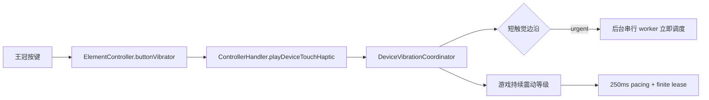

# 王冠按键触觉反馈修复设计

## 问题

Issue #633 反馈：王冠虚拟按键在快速连续点击时只有第一次有机身震动，后续点击必须等待一段时间才有反馈。

当前按键反馈使用 50ms 短脉冲，但它与游戏持续震动共用 `DeviceVibrationCoordinator` 和 `LatestWinsDispatcher`。调度器的默认最小调用间隔是 250ms，用来保护部分厂商振动服务免受长时间震动效果的高频重编程。短脉冲没有被区分，导致快速点击被延迟并被 latest-wins pending 槽覆盖。

## 目标

- 王冠按键的短触觉在正常快速连击下及时触发。
- 游戏持续震动继续使用现有的 250ms 安全节流和有限租约。
- 所有系统振动调用仍通过同一个后台 worker 串行执行。
- 保持 latest-wins 的有界队列，避免厂商 Binder 卡住时无限堆积任务。
- 不改变串流协议、主机行为、common-c 或 Sunshine。

## 调用链

## 方案

触摸震动命令设置为 `urgent`。现有 `LatestWinsDispatcher` 会让 urgent 命令跳过普通等级命令的最小间隔，但仍然遵守以下约束：

1. 只有一个 worker 执行 Android `Vibrator` 调用。
2. 正在执行的系统调用不会被并发打断。
3. pending 槽最多保留一个最新命令。
4. 音频触觉获得设备马达所有权时，触摸命令仍然被拒绝。
5. 触觉结束后，协调器继续恢复最新的游戏震动状态。

这个改动只改变短触觉命令的调度优先级，不改变游戏震动的等级 pacing。

## 不采用的方案

不删除全局 250ms 间隔，也不把触摸反馈改成另一套直接调用 `Vibrator` 的实现。前者会重新暴露已修复的厂商振动服务 ANR，后者会绕过现有的音频所有权、停止清理和后台阻塞隔离。

## 兼容性

改动使用现有 `VibrationCommand.urgent` 字段和 Android 22 兼容的调用链，不新增 API、权限或协议字段。新版屏幕虚拟手柄的独立 `performClickHaptic()` 路径不在本次范围内。

## 验证

- 单元测试验证游戏震动仍可正常恢复。
- 单元测试验证连续三次短触觉不会等待 250ms。
- 编译 `nonRootDebug` Kotlin 和 AndroidTest。
- 执行 `testNonRootDebugUnitTest`、`lintNonRootDebug` 和 `assembleNonRootDebug`。

