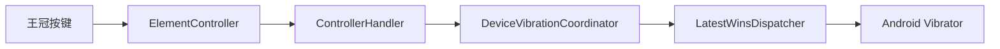
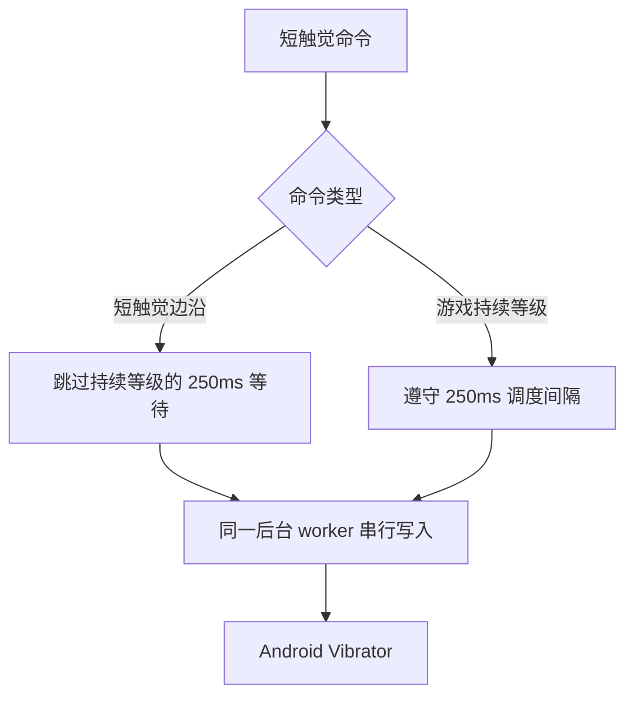

# 王冠按键触觉调度设计

状态：已在 [PR #637](https://github.com/qiin2333/moonlight-vplus/pull/637) 实现。

相关问题：[Issue #633](https://github.com/qiin2333/moonlight-vplus/issues/633)

## 摘要

王冠虚拟按键的短触觉与游戏持续震动使用同一设备振动调度器。游戏持续震动需要限制系统调用频率，以规避部分厂商振动服务在高频重编程时出现的卡顿或 ANR；短触觉属于离散点击反馈，不应等待同一时间间隔。

本设计在保持后台串行输出、有界 pending 队列和音频触觉所有权控制的前提下，将短触觉识别为即时事件，使快速连续点击可以及时获得反馈。

## 用户可见问题

Issue #633 报告：开启王冠按键震动后，第一次点击有反馈，快速连续点击的后续反馈消失；两次点击需要等待固定时间才能再次触发。

问题只涉及客户端本地设备振动反馈，不涉及主机输入包、Sunshine 或串流协议。

## 原因分析

在统一设备振动调度接入后，调用链如下：

`LatestWinsDispatcher` 默认以 250ms 间隔调度持续震动等级。它最多保留一个待处理命令，新的命令会替换旧的待处理命令。原实现没有区分短触觉和持续震动，因此快速点击会被延迟或合并。

## 设计目标

1. 正常快速连击时，每个短触觉都能及时进入设备振动分发。
2. 游戏持续震动继续使用现有的频率限制和有限租约。
3. Android `Vibrator` 调用仍由单一后台 worker 串行执行。
4. 系统服务阻塞时，队列仍保持有界，不阻塞 UI 线程。
5. 不新增串流协议、主机能力位、权限或 Android API 要求。

## 方案

触摸触觉命令设置 `urgent = true`，使用现有调度器的即时分支：

该方案只改变短触觉命令的调度优先级，其他生命周期行为保持不变：

- 正在执行的系统振动调用不会被并发打断。
- pending 队列仍只有一个最新命令。
- 音频触觉取得设备马达所有权时，新的触摸触觉仍不会越权写入。
- 触觉结束后，协调器继续恢复最新的游戏震动状态。
- 生成代次检查仍会丢弃已经失效的旧命令。

## 方案边界

本次修复不删除持续游戏震动的 250ms 限制，也不重新引入绕过协调器的直接 `Vibrator` 调用。前者会削弱对厂商振动服务的保护，后者会绕过现有的所有权、停止清理和后台阻塞隔离。

新版屏幕虚拟手柄的独立点击反馈路径不属于本次修改范围；只有在该路径出现同样的可复现问题时，才单独评估。

## 兼容性与影响范围

- 支持项目当前的最低 Android API 22。
- 不改变主机输入、串流数据或 common-c。
- 不新增权限、配置格式或用户迁移逻辑。
- 游戏持续震动、音频触觉和设备停止清理继续使用原有流程。

## 验证

新增单元测试覆盖连续三次短触觉在游戏震动活跃时仍能及时分发，并保留已有的游戏震动恢复、音频所有权和停止清理测试。

已执行并通过：

- `:app:testNonRootDebugUnitTest`
- `:app:compileNonRootDebugAndroidTestKotlin`
- `:app:lintNonRootDebug`
- `:app:assembleNonRootDebug`

单元测试验证的是客户端调度逻辑；不同厂商的振动服务仍可能对极端高频调用进行系统级合并，这是 Android 设备实现差异，不由本次客户端调度修复承诺消除。
